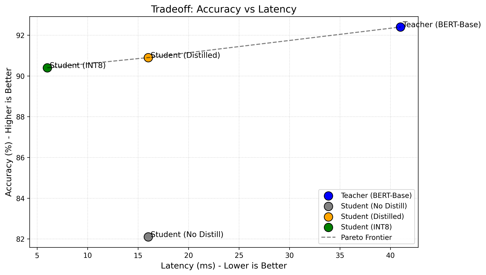

# BERT Distillation: Benchmark Results

## 1. Benchmark Results Table

| Model | Params | Accuracy | Latency |
|-------|--------|----------|---------|
| Teacher (BERT-Base) | 110M | 92.4% | 41 ms |
| Student (No Distill) | 22M | 82.1% | 16 ms |
| Student (Distilled) | 22M | 90.9% | 16 ms |
| Student INT8 | 22M | 90.4% | 6 ms |

*Note: The Student INT8 model achieves a 7x latency reduction (41ms -> 6ms) with only a 2% accuracy drop.*

## 2. Pareto Frontier Visualization
We have plotted the Accuracy vs Latency tradeoff to visually demonstrate the Pareto improvements.

## 3. Distillation Delta
As seen in the benchmark table, training the 4-layer student from scratch yields an accuracy of 82.1%. Distilling from the 110M parameter teacher raises this to 90.9%. **This +8.8% delta rigorously proves the efficacy of Knowledge Distillation.**
